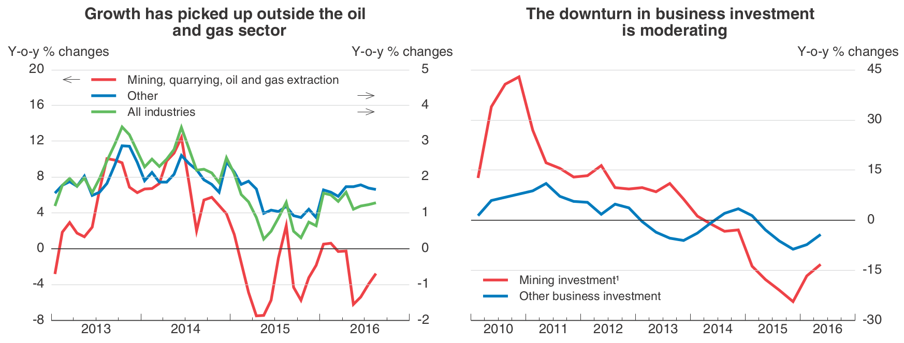
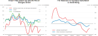
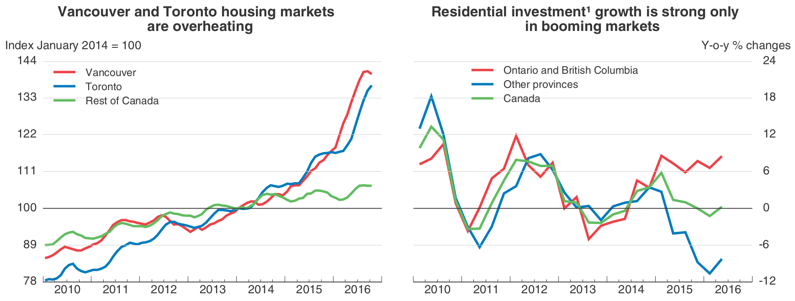
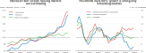

 
```{r init, message=FALSE, warning=FALSE, echo=FALSE}
library(cneo2016)
library(stringr)

library(lattice)
library(latticeExtra)
library(latex2exp)
library(grid)
library(xts)
library(dygraphs)

library(dplyr)
library(tidyr)
library(ggplot2)
library(ggiraph)

library(plotly)
library(rsvg)

source("util/lattice-settings.R")
```


## Data Structure

- StatLink 1: [http://dx.doi.org/10.1787/888933437487](http://dx.doi.org/10.1787/888933437487)
- StatLink 2: [http://dx.doi.org/10.1787/888933437497](http://dx.doi.org/10.1787/888933437497)

```{r data, echo=FALSE}
eoLoad <- function(file=stop("'file' must be provided")) {
  dat <- read.table(file = file, header = TRUE, sep = "\t", na = "ND")
  dat$date <- changeDates(dat$date)
  return(dat)
}

dataPath <- system.file("extdata/can", package = "cneo2016")
list.files(dataPath)
fname <- c("can11.tsv",
           "can12.tsv",
           "can21.tsv",
           "can22.tsv")
eoData <- lapply(file.path(dataPath, fname), eoLoad)
names(eoData) <- tools::file_path_sans_ext(fname)
```

```{r kable-dat, echo=FALSE, results='as.is'}
knitr::kable(head(eoData$can11, 3))
knitr::kable(head(eoData$can12, 3))
knitr::kable(head(eoData$can21, 3))
knitr::kable(head(eoData$can22, 3))
```


## Static Chart 1

### FAME Output

```{r fame-output-1, out.width='100%', echo=FALSE}
## 

```

### ggplot2 Output

- ggplot2: [Specify a secondary axis](http://ggplot2.tidyverse.org/reference/sec_axis.html) using `sec_axis`
- alternative: plotting independent series: [Dual axis in ggplot2](https://rpubs.com/kohske/dual_axis_in_ggplot2)

```{r ggplot-chart-1, out.width='50%', echo=FALSE, warning=FALSE, cache=TRUE}
divfactor <- 4
y1lim <- c(-2, 4)
y2lim <- c(-8, 16)
## manually setting ticks
ybreaks <- function(x, by=1) seq(x[1], x[2], by)
## calculate number of labels
nquarter <- function(xlim) {
  yearLim <- as.integer(format(xlim, "%Y"))
  res <- (yearLim[2] - yearLim[1] + 1) * 4
  return(res)
}

## theme
theme_cneo <- function(...) {
  theme_bw(base_size = 17) %+replace%
    theme(## legend.position = "top",
      legend.direction = "vertical",
      legend.key.width = unit(14, "mm"),
      legend.key.height = unit(6, "mm"),
      legend.title = element_blank(),
      panel.border = element_blank(),
      axis.line.x = element_line(color = 'black'),
      axis.ticks.y = element_blank(),
      axis.ticks.x = element_line(size = .5),
      axis.ticks.length = unit(.2, "cm"),
      ## axis.title.y = element_text(vjust = 1,
      ##                             margin = margin(r = -3, unit = "cm"),
      ##                             size = rel(.9)),
      ## axis.title.y.right = element_text(vjust = 1,
      ##                             margin = margin(l = -3, unit = "cm")),
      panel.grid.major.x = element_blank(),
      panel.grid.minor.x = element_blank(),
      panel.grid.minor.y = element_blank(),
      plot.title = element_text(hjust = 0.5, face = "bold"
                                ## margin = margin(b = 4, unit = "mm")
                                ),
      ...
    )
}

## chart 1-1
label_ind_1 <- data.frame(industry = c("mining", "other", "total"),
                        indlabel = c("Mining, quarrying, oil and gas extraction -->",
                                     "<-- Other",
                                     "<-- All industries"),
                        stringsAsFactors = FALSE)

## TeX("$\\leftarrow$ All Industries")

## data_long_1 <-
##   eoData$can11 %>%
##   mutate(mining = mining / divfactor) %>%
##   gather(key = industry, value = value, -date) %>%
##   left_join(label_ind_1, by = "industry")

data_long_1 <-
  eoData$can11 %>%
  ## mutate(mining = mining / divfactor) %>%
  gather(key = industry, value = value, -date) %>%
  mutate(value_scaled = ifelse(industry %in% c("mining"), value / divfactor, value)) %>%
  left_join(label_ind_1, by = "industry")

data_long_1$indlabel <- factor(data_long_1$indlabel, levels = label_ind_1$indlabel)

xlim <- c(min(data_long_1$date), max(data_long_1$date))
## nquarter(xlim = xlim)

p1 <-
  ggplot(data = data_long_1,
         aes(x = date, y = value_scaled, color = indlabel)) +
  scale_color_manual(values = rev(lineColors$pal3)) +
  scale_x_date(name = NULL,
               breaks = scales::date_breaks("1 year"), # date_breaks("3 months")
               labels = scales::date_format("%Y")) + # date_format("%b %Y")
  ggtitle("Growth has picked up outside the oil\nand gas sector") +
  theme_cneo(
    axis.title.y = element_text(vjust = 1,
                                margin = margin(r = -3, unit = "cm"),
                                size = rel(.9)),
    axis.title.y.right = element_text(margin = margin(l = -3, unit = "cm")),
    legend.position = "top"
  )

p1 + geom_line(size = 1.5) +
    scale_y_continuous("Y-o-y % changes",
                     breaks = ybreaks(y1lim),
                     sec.axis = sec_axis(~.*divfactor,
                                         breaks = ybreaks(y2lim, by = divfactor),
                                         name = derive()
                                         ## name = ""
                                         ))

## chart 1-2
label_ind_2 <- data.frame(industry = c("mining", "other"),
                        indlabel = c("Mining investment",
                                     "Other business investment"),
                        stringsAsFactors = FALSE)

data_long_2 <-
  eoData$can12 %>%
  gather(key = industry, value = value, -date) %>%
  left_join(label_ind_2, by = "industry")

data_long_2$indlabel <- factor(data_long_2$indlabel, levels = label_ind_2$indlabel)

p2 <-
  ggplot(data = data_long_2, aes(x = date, y = value, color = indlabel)) +
  scale_color_manual(values = lineColors$pal2) +
  scale_y_continuous(name = "Y-o-y % changes",
                     position = "right") +
  ggtitle("The downturn in business investment\nis moderating") +
  theme_cneo(
    axis.title.y = element_text(vjust = 1),
    axis.title.y.right = element_text(margin = margin(l = -3.5, unit = "cm"),
                                      size = rel(.9)),
    legend.position = c(0.25, 0.15)
  )

p2 + geom_line(size = 1.5)

```

### ggplotly

**Issues:** R plotly currently does not draw the secondary y-axis defined using the `sec.axis` parameter. Also, modifications to axis title positions and legends are not reflected properly and multi-line titles overlap with the plotly mode bar

```{r ggplotly-chart1, out.width='100%', echo=FALSE, warning=FALSE, eval=TRUE}
p1text <- p1 +
  geom_line(aes(y = value), color = NA) +
  geom_line(aes(text = value)) +
  ## scale_y_continuous(limits = c(-2, 4))
  scale_y_continuous("Y-o-y % changes",
                     limits = c(-2, 4),
                     breaks = ybreaks(y1lim),
                     sec.axis = sec_axis(~.*divfactor,
                                         breaks = ybreaks(y2lim, by = divfactor),
                                         name = derive()
                                         ## name = ""
                                         ))

ggplotly(p1text, tooltip = c("text"), width = 800)

```

### latticeExtra Double Y-Scales

<!-- ```{r can1, fig.width=4.38, fig.height=3.5, echo=FALSE} -->
```{r lattice-chart-1, out.width='50%', echo=FALSE}
## chart 1-1
y1lim <- c(-2, 4)
y2lim <- c(-8, 16)

obj1 <-
  xyplot(total + other ~ date, data = eoData$can11, type = "l", ylim = y1lim,
         scales = list(y = list(at = atLim(y1lim))),
         xscale.components = add.lattice.xsubticks,
         axis = axisEOleft,
         panel = panelEO,
         ## ylab = ylabGrid(label = "Y-o-y % changes", hjust = 0.4),
         ylab = "Y-o-y % changes",
         xlab = "",
         main = "Growth has picked up outside the oil\nand gas sector")

obj2 <-
  xyplot(mining ~ date, data = eoData$can11, type = "l", ylim = y2lim,
         ## ylab = "Y-o-y % changes",
         scales = list(y = list(at = atLim(y2lim, 4)), tck = 0)) # do not draw ticks,

cad <-
  doubleYScale(obj1, obj2,
               style1 = 0, style2 = 3,
               ## add.ylab2 = TRUE, # FALSE,
               text = c(
                 TeX("$\\leftarrow$ All Industries"),
                 TeX("$\\leftarrow$ Other"),
                 TeX("Mining, quarrying, oil and gas extraction $\\rightarrow$")),
               columns = 1)


## re-plot with different styles
update(cad,
       par.settings = par.settingsEO(pal = "pal3", pos = "both")
       )

## chart 1-2
y1lim <- c(-30, 45)
xyplot(mining + other ~ date, data = eoData$can12, type = "l", ylim = y1lim,
       scales = list(y = list(at = atLim(y1lim, 15))),
       xscale.components = add.lattice.xsubticks,
       axis = axisEOright,
       panel = function(...) panelEO(hgrid = 4, ...),
       ylab = "",
       ylab.right = "Y-o-y % changes",
       xlab = "",
       main = "The downturn in business investment\nis moderating",
       par.settings = par.settingsEO("pal2", pos = "right"),
       auto.key = list(text = c("Mining investment",
                                "Other business investment"),
                       lines = TRUE,
                       points = FALSE,
                       columns = 1,
                       corner = c(0.1, 0.1)
                       )
       )

```

## Static Chart 2

### FAME Output

<!--  -->
<!--  -->

```{r fame-output-2, out.width='100%', echo=FALSE}
## 

```

### lattice Output

<!-- ```{r can2, echo=FALSE} -->
```{r lattice-chart-2, out.width='50%', echo=FALSE}
y1lim <- c(78,144)
xyplot(rest + toronto + vancouver ~ date, data = eoData$can21, type = "l", ylim = y1lim,
       scales = list(y = list(at = atLim(y1lim, 11))),
       xscale.components = add.lattice.xsubticks,
       axis = axisEOleft,
       panel = function(...) panelEO(hgrid = 5, intercept = 100, ...),
       ylab = "Index January 2014 = 100",
       xlab = "",
       main = "Vancouver and Toronto housing markets\nare overheating",
       par.settings = par.settingsEO("pal3"),
       auto.key = list(text = c("Rest of Canada",
                                "Toronto",
                                "Vancouver"),
                       lines = TRUE,
                       points = FALSE,
                       columns = 1,
                       corner = c(0, 1)
                       )
       )

y1lim <- c(-12,24)
xyplot(total + other + ontario ~ date, data = eoData$can22, type = "l", ylim = y1lim,
       scales = list(y = list(at = atLim(y1lim, 6))),
       xscale.components = add.lattice.xsubticks,
       axis = axisEOright,
       panel = function(...) panelEO(hgrid = 5, ...),
       ylab = "",
       ylab.right = "Y-o-y % changes",
       xlab = "",
       main = "Residential investment growth is strong only\nin booming markets",
       par.settings = par.settingsEO("pal3", pos = "right"),
       auto.key = list(text = c("Canada",
                                "Other provinces",
                                "Ontario and British Columbia"),
                       lines = TRUE,
                       points = FALSE,
                       columns = 1,
                       corner = c(0.5, 1)
                       )
       )


```

- x-axis subticks: https://github.com/Rapporter/pander/blob/master/R/graph.R and Sarkar, 2008, Lattice: Multivariate Data Visualization with R, Springer, pp.146f.
- missing: right y-axis label, automatic left y-axis label position, quarterly minor ticks, legend inside plot area in doubleYScale using `corner([0;1],[0;1])`, flashes outside legend, legend line colors on left-hand side
- todo: expand x-axis, increase relative font size axis tick labels, increase visibility of grid lines using `panel.grid()`


## Dygraphs

- [xts: Plotting Time Series in R using Yahoo Finance data](http://blog.revolutionanalytics.com/2015/08/plotting-time-series-in-r.html)


<!-- ```{r dygraph, fig.width = 7.5, echo=FALSE, eval=TRUE} -->
```{r dygraph, out.width='100%', echo=FALSE, eval=TRUE}

y1lim <- c(-2, 4)
y2lim <- c(-8, 16)
can11xts <- eoData$can11
rownames(can11xts) <- can11xts$date
can11xts <- can11xts[, !colnames(can11xts)%in%c("date")]       # using info from rownames implicitly
dygraph(can11xts) %>%
  dyRangeSelector() %>%
  dyShading(from = "2013-10-1", to = "2013-12-1") %>%
  dyShading(from = "2014-6-1", to = "2014-8-1") %>%
  dyShading(from = "2014-10-1", to = "2015-4-1") %>%
  dyShading(from = "2015-8-1", to = "2015-10-1") %>%
  dyShading(from = "2016-2-1", to = "2016-5-1") %>%
  dyAxis("y", valueRange = y1lim, label = "Y-o-y % changes") %>%
  dyAxis("y2", valueRange = y2lim, label = "Y-o-y % changes", independentTicks = TRUE) %>%
  dySeries("total", axis = "y", label = "<-- Total") %>%
  dySeries("other", axis = "y", label = "<-- Other") %>%
  dySeries("mining", axis = "y2", label = "Mining -->") %>%
  dyOptions(colors = lineColors$pal3,
            strokeWidth = 2,
            ## drawYAxis = FALSE,
            drawGrid = FALSE,
            drawAxesAtZero = TRUE) %>%
  dyHighlight(highlightCircleSize = 3,
              highlightSeriesBackgroundAlpha = 0.2,
              hideOnMouseOut = TRUE)
```

### Todo

- fix JS: keep axis ticks when `drawYAxis = FALSE`, keep horizontal lines when `drawGrid = FALSE` using `drawXGrid` and `drawYGrid` from version 1.1.0 (current version 2.0.0)

## Plotly

- [plot.ly: Multiple Axes in R](https://plot.ly/r/multiple-axes/)
- replace plotly icon in hover modebar (see http://rdata.work/technical/2015/07/26/javascript.html, "plotly.js")
- the modified plotly.js library can be found at https://s3.eu-central-1.amazonaws.com/cdn-plotly/plotly-custom.min.js
- export SVG from plotly: `plotly::export()` function allows exporting an SVG vector image using the RSelenium package to establish a connection to a web browser

```{r plotly-multiple-y, out.width='100%', message=FALSE, warning=FALSE, echo=FALSE}
y1lim <- c(-2, 4)
y2lim <- c(-8, 16)

ay1 <- list(
  tickmode = "linear",
  tick0 = y1lim[1],
  dtick = 1,
  range = y1lim
)

ay2 <- list(
  tickfont = list(color = "red"),
  tickmode = "linear",
  tick0 = y2lim[1],
  dtick = 4,
  overlaying = "y",
  side = "right",
  title = "Y-o-y % changes",
  range = y2lim
)

p <- plot_ly() %>%
  add_lines(x = eoData$can11$date, y = eoData$can11$total, line = list(color=lineColors$pal3[1]), name = "<-- Total") %>%
  add_lines(x = eoData$can11$date, y = eoData$can11$other, line = list(color=lineColors$pal3[2]), name = "<-- Other") %>%
  add_lines(x = eoData$can11$date, y = eoData$can11$mining, line = list(color=lineColors$pal3[3]), name = "Mining -->", yaxis = "y2") %>%
  layout(
    title = "",
    yaxis = ay1,
    yaxis2 = ay2,
    xaxis = list(title="")
##  ,
    ## width = 800,                        # in px, 
    ## height = 500                        # determines ratio of svg
  )
p
```

## Plotly Static Image Export (SVG)

```{r plotly-export-svg, out.width='100%', message=FALSE, echo=TRUE, cache=TRUE}
fig_path <- "assets/img"
file_name <- "plotly-multiple-y"
svg_file <- paste0(file_name, ".svg")
svg_tofile <- file.path(fig_path, svg_file)
unlink(svg_tofile)
## chrome options
eCaps <- list(
  chromeOptions =
    list(prefs = list(
      "profile.default_content_settings.popups" = 0L,
      "download.prompt_for_download" = FALSE,
      "download.default_directory" = file.path(getwd(), fig_path)
      )))

## create plot
suppressMessages(
  rD <- RSelenium::rsDriver(port = 4590L,
                            browser = "chrome",
                            geckover = NULL,
                            iedrver = NULL,
                            phantomver = NULL,
                            extraCapabilities = eCaps,
                            verbose = FALSE)
)

p$layout$height <- 480                  # match interactive plot height
export(p = p, file = svg_file, selenium = rD)
Sys.sleep(1)
rDstop <- rD[["server"]]$stop()
knitr::include_graphics(svg_tofile)
## convert to print formats
rsvg_pdf(svg_tofile, file.path(fig_path, paste0(file_name, ".pdf")))
rsvg_ps(svg_tofile, file.path(fig_path, paste0(file_name, ".eps")))
```

- [PDF file](assets/img/plotly-multiple-y.pdf)
- [EPS file](assets/img/plotly-multiple-y.eps)


## ggiraph

```{r ggiraph-chart11, warning=FALSE, echo=FALSE}
knitr::kable(data_long_1[order(data_long_1$date),][1:3,])

gg_interactive_1 <-
  p1 + geom_line(size = 1.5) +
  scale_y_continuous("Y-o-y % changes",
                     breaks = ybreaks(y1lim),
                     sec.axis = sec_axis(~.*divfactor,
                                         breaks = ybreaks(y2lim, by = divfactor),
                                         name = derive()
                                         )) +
  geom_point_interactive(aes(tooltip = round(value, 2)), size = 2)

ggiraph(code = print(gg_interactive_1), width = .8, width_svg = 8)

```
